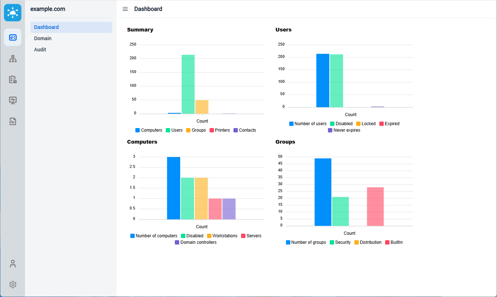

# Sysadmin Anywhere




**[Docker compose file examle](docker/docker-compose.yml)**

**Sysadmin Anywhere environment variables:**
```
- DB_ADDRESS=postgres
- DB_PORT=5432
- DB_BASE=sysadminanywhere
- DB_USER=sysadminanywhere
- DB_PASSWORD=sysadminanywhere
- LDAP_SERVER=192.168.1.1
- LDAP_PORT=636
- LDAP_GROUPS_ALLOWED=CN=Domain Admins,CN=Users,DC=example,DC=com
- INVENTORY_ADDRESS=http://localhost:8081
```

**Inventory environment variables:**
```
DB_ADDRESS=localhost
DB_PORT=5432
DB_BASE=inventory
DB_USER=postgres
DB_PASSWORD=123456

LDAP_SERVER=192.168.1.1
LDAP_PORT=636
LDAP_USERNAME=<username>
LDAP_PASSWORD=<password>

SCAN.CRON=0 0 * * * *
```
Use the "username" and "password' of a user who has rights to read from the Active Directory and from the WMI service on domain computers.
