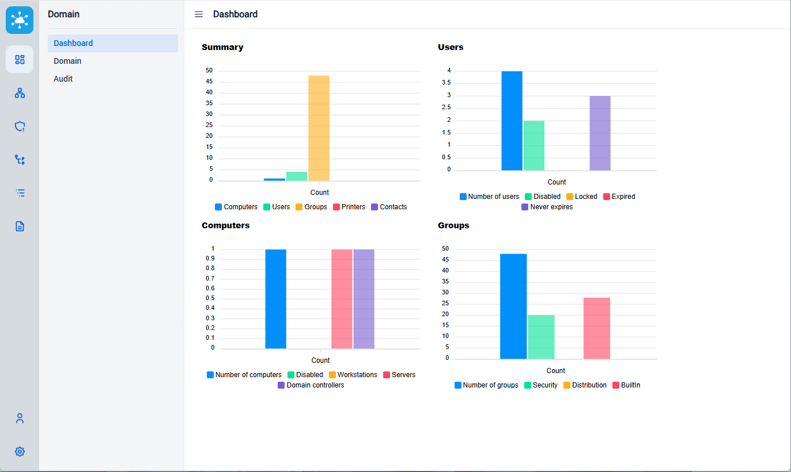

# Sysadmin Anywhere


A comprehensive web-based Active Directory management platform that provides a unified interface for simplifying administrative tasks across your network infrastructure.



## 🚀 Overview

Sysadmin Anywhere is a powerful Spring Boot + Vaadin application designed for system administrators who need centralized control over their Active Directory environment. It combines modern web technologies with robust AD management capabilities to deliver an intuitive, feature-rich administration experience.

## ✨ Key Features

### 📋 Active Directory Management
- **User Management**: Add, edit, delete users with comprehensive attribute support
- **Group Operations**: Add/remove objects from groups with bulk operations
- **Password Management**: Secure password reset functionality
- **User Photos**: Add and manage user profile pictures
- **CSV Import**: Bulk user import from CSV files
- **Templates**: Reusable templates for rapid user provisioning
- **Auditing**: Complete audit trail of all administrative actions
- **Unlimited Objects**: No artificial limits on AD objects

### 🖥️ Remote Computer Management
- **System Control**: Restart and shutdown remote computers
- **Process Monitoring**: View and manage processes on remote systems
- **Service Management**: Monitor and control services across the network
- **Event Viewing**: Access Windows event logs remotely
- **Performance Monitoring**: Real-time computer performance metrics

### 📊 Inventory & Reporting
- **Hardware Inventory**: Detailed hardware information collection
- **Software Inventory**: Comprehensive software asset management
- **Incident Management**: Incident tracking and resolution (preview)
- **20+ Reports**: Extensive reporting capabilities with customizable outputs

### 🤖 Automation & Integration
- **n8n Workflows**: Build automation workflows using n8n integration
- **API Support**: RESTful API for third-party integrations
- **Monitoring**: Automated monitoring and alerting capabilities

## 🌍 Internationalization

Full multi-language support with professional translations:
- 🇺🇸 English
- 🇩🇪 German
- 🇫🇷 French
- 🇪🇸 Spanish
- 🇵🇹 Portuguese
- 🇮🇹 Italian
- 🇨🇳 Chinese
- 🇯🇵 Japanese
- 🇷🇺 Russian

## 🛠️ Technology Stack

- **Backend**: Spring Boot 4.0.6, Java 21
- **Frontend**: Vaadin Flow framework
- **Build Tool**: Maven
- **Architecture**: Modular multi-module Maven project
- **Security**: Spring Security with AD integration
- **Caching**: Spring Cache for performance optimization

## 📁 Project Structure

```
SysadminAnywhere/
├── main/           # Main application module
├── common/         # Shared utilities and components
├── directory/      # Active Directory integration
├── inventory/      # Hardware/software inventory
├── incident/       # Incident management
├── e2e-tests/      # End-to-end tests
├── docs/           # Documentation and guides
└── docker/         # Docker configuration
```

## 🚀 Quick Start

### Prerequisites

- Docker and Docker Compose
- Active Directory domain access
- Windows environment (recommended)

### Production Deployment (Recommended)

Sysadmin Anywhere uses a microservices architecture with Docker Compose for production deployment:

1. **Clone the repository**
   ```bash
   git clone https://github.com/sysadminanywhere/sysadminanywhere.git
   cd sysadminanywhere
   ```

2. **Configure environment variables**
   ```bash
   cp docker/prod/.env.example docker/prod/.env
   # Edit docker/prod/.env with your configuration
   ```

3. **Start all services**
   ```bash
   cd docker/prod
   docker-compose up -d
   ```

4. **Access the services**
   - **Main Application**: `http://localhost:8080`
   - **n8n Automation**: `http://localhost:5678`
   - **Inventory Service**: `http://localhost:8082` (internal)

### Microservices Architecture

The production deployment includes the following services:

- **sysadminanywhere** - Main web application (Port 8080)
- **directory** - Active Directory integration service
- **inventory** - Hardware/software inventory service  
- **incident** - Incident management service
- **db** - PostgreSQL database
- **vault** - HashiCorp Vault for secrets management
- **n8n** - Workflow automation platform

### Development Setup

For local development, you can run individual services:

1. **Build all modules**
   ```bash
   ./mvnw clean install
   ```

2. **Start specific service**
   ```bash
   ./mvnw spring-boot:run -pl main          # Main application
   ./mvnw spring-boot:run -pl directory      # Directory service
   ./mvnw spring-boot:run -pl inventory      # Inventory service
   ./mvnw spring-boot:run -pl incident       # Incident service
   ```

### Environment Configuration

Key environment variables in `docker/prod/.env`:

```bash
# Database
DB_NAME=sysadminanywhere
DB_USER=postgres
DB_PASSWORD=your_secure_password

# Active Directory
LDAP_SERVER=dc.example.local
LDAP_PORT=389
LDAP_USE_SSL=false

# Security
VAULT_TOKEN=your_vault_token
JWT_SECRET=your_jwt_secret

# n8n Automation
N8N_USER=admin
N8N_PASSWORD=your_n8n_password
N8N_API_KEY=your_n8n_api_key
```

## 📚 Documentation

- **[Official Documentation](https://docs.sysadminanywhere.com)** - Comprehensive user guides and API documentation
- **[User Guide](docs/user-guide-en.md)** - Detailed usage instructions
- **[n8n Integration Guide](docs/n8n-integration-guide-en.md)** - Automation workflow setup
- **[API Documentation](docs/ai-openapi.yaml)** - REST API reference

## 🔧 Configuration

The application can be configured through Spring Boot properties files. Key configuration areas include:

- Active Directory connection settings
- Security and authentication
- Database configuration (if using external storage)
- Caching settings
- Logging configuration

## 🤝 Contributing

We welcome contributions! Please see our contributing guidelines for details on:

- Bug reporting
- Feature requests
- Pull request process
- Code style guidelines

## 📄 License

This project is licensed under the MIT License - see the [LICENSE](LICENSE) file for details.

Copyright © 2023 Igor Markin

## 🔗 Related Projects

- **[n8n](https://n8n.io/)** - Workflow automation platform used for advanced automation
- **[Spring Boot](https://spring.io/projects/spring-boot)** - Application framework
- **[Vaadin](https://vaadin.com/)** - Web framework for Java

## 📞 Support

- 📖 [Documentation](https://docs.sysadminanywhere.com)
- 🐛 [Issue Tracker](https://github.com/sysadminanywhere/sysadminanywhere/issues)
- 💬 [Discussions](https://github.com/sysadminanywhere/sysadminanywhere/discussions)

---

**Made with ❤️ for system administrators worldwide**
